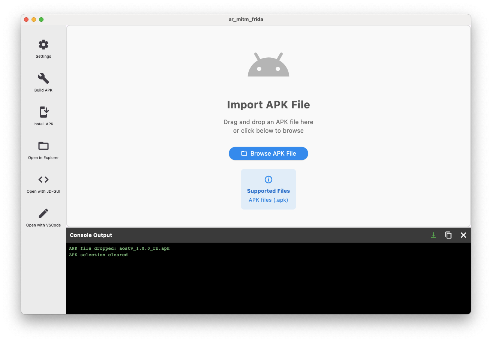
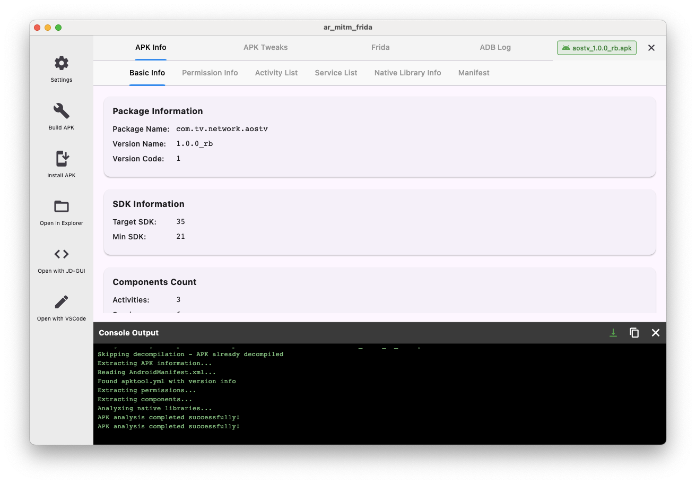
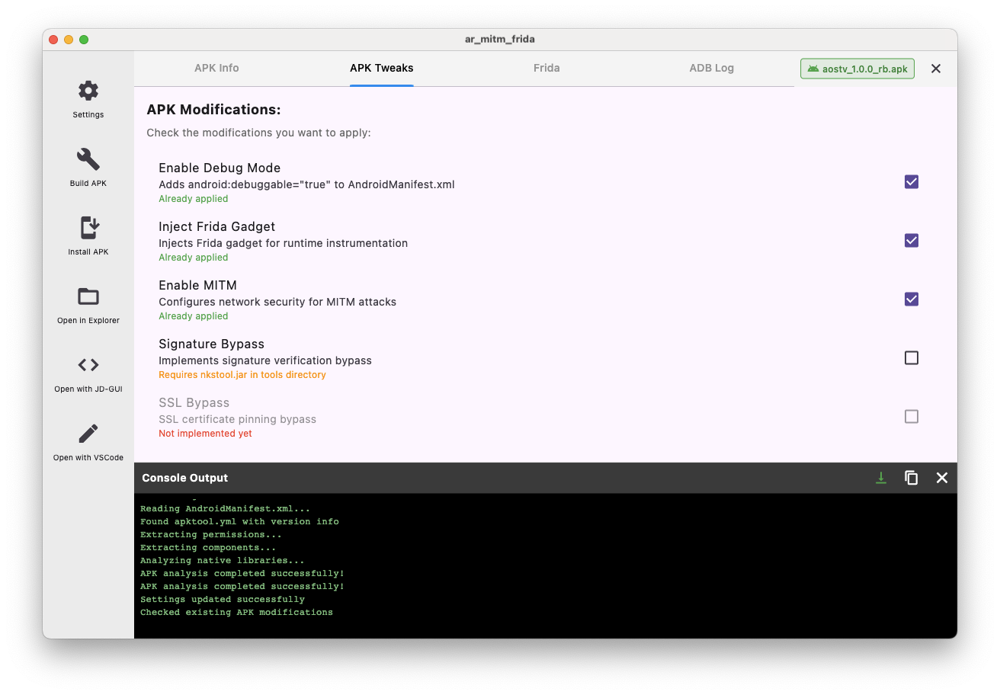
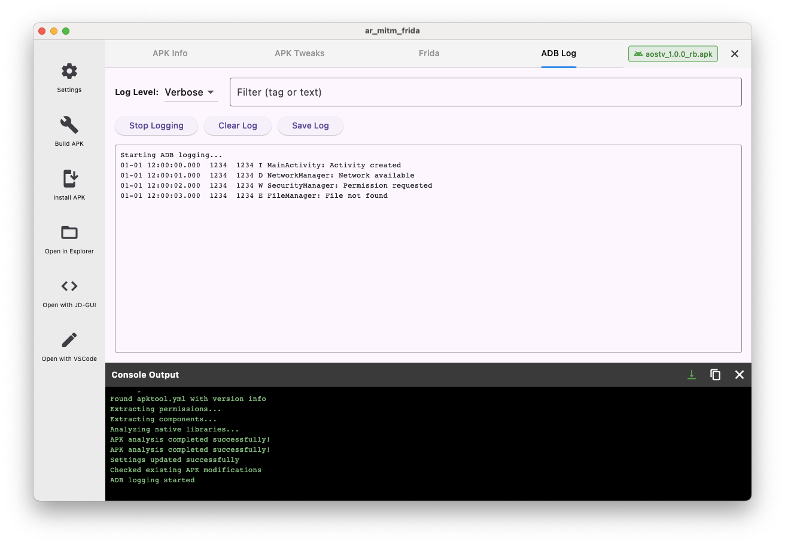
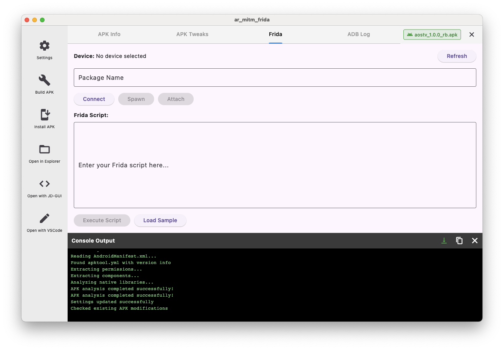
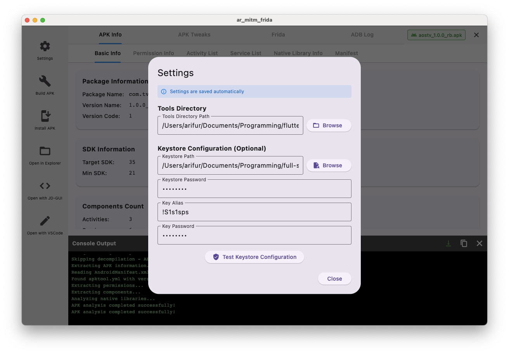
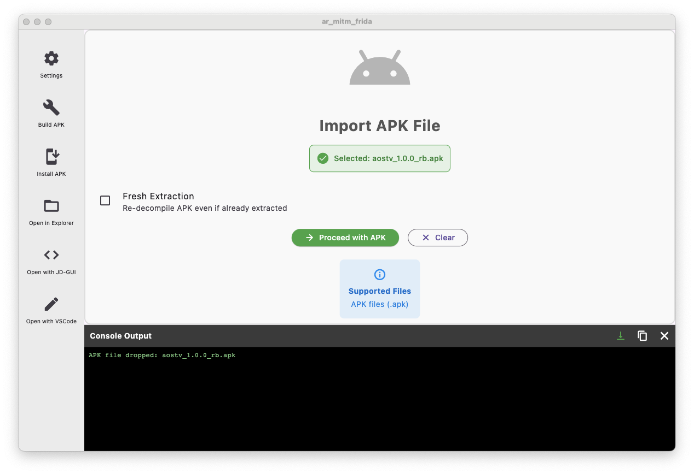

# Android Reverse Tools (AR-MITM-Frida)

A powerful Flutter-based desktop application for Android APK reverse engineering, modification, and analysis. This cross-platform tool provides a modern GUI alternative to command-line tools for security researchers and developers.



## Features

### 🔍 APK Analysis
- Comprehensive APK information extraction (package name, version, permissions, etc.)
- AndroidManifest.xml parsing and display
- Built-in decompilation using APKTool



### 🛠️ APK Modifications (Tweaks)
- **Enable Debug Mode**: Make any APK debuggable
- **Frida Gadget Injection**: Automatically inject Frida for runtime manipulation
- **MITM Configuration**: Add network security config for SSL/TLS interception
- **Signature Bypass**: Bypass signature verification (requires Java 8)
- Auto-detection of already applied modifications



### 📱 Device Integration
- ADB device management and log viewer
- One-click APK installation to connected devices
- Real-time ADB logcat viewer with filtering



### 🔐 Frida Integration
- Built-in Frida console
- Load and execute Frida scripts
- Real-time script output monitoring



### 🔑 Keystore Management
- Custom keystore configuration
- APK signing with your certificates
- Keystore validation tool



### 🚀 Additional Features
- Drag-and-drop APK import
- Fresh extraction toggle (re-decompile vs. use existing)
- Build modified APKs with automatic signing
- Open decompiled source in VS Code
- JD-GUI integration for Java decompilation
- Cross-platform support (macOS, Windows, Linux)



## Prerequisites

- Flutter SDK (3.0+)
- Java JDK (8+ required, Java 8 recommended for signature bypass)
- Android SDK Platform Tools (for ADB)
- Python with Frida installed (for Frida features)

## Installation

1. Clone the repository:
```bash
git clone https://github.com/yourusername/android-reverse-tools.git
cd android-reverse-tools/ar_mitm_frida
```

2. Install Flutter dependencies:
```bash
flutter pub get
```

3. Download required tools:
   - Create a `tools` directory in the project root
   - Add the following tools:
     - `apktool.jar` - [Download APKTool](https://apktool.org/)
     - `uber-apk-signer.jar` - [Download Uber APK Signer](https://github.com/patrickfav/uber-apk-signer)
     - `jadx-gui.jar` (optional) - [Download JADX](https://github.com/skylot/jadx)
     - `jd-gui.jar` (optional) - [Download JD-GUI](https://java-decompiler.github.io/)
     - Frida gadget libraries in `tools/frida/` directory

4. Configure environment:
   - Copy `.env.example` to `.env`
   - Set your tools directory path:
     ```
     TOOLS_DIR=/path/to/your/tools
     ```

5. Build and run:
```bash
# For macOS
flutter build macos
flutter run -d macos

# For Windows
flutter build windows
flutter run -d windows

# For Linux
flutter build linux
flutter run -d linux
```

## Usage

1. **Import APK**: Drag and drop an APK file or click "Browse APK File"
2. **Analyze**: The tool automatically decompiles and analyzes the APK
3. **Apply Tweaks**: Select desired modifications and click "Apply Tweaks"
4. **Build**: Click "Build APK" to create the modified APK
5. **Install**: Click "Install APK" to install on connected devices

## Project Structure

```
ar_mitm_frida/
├── lib/
│   ├── main.dart              # Application entry point
│   ├── screens/               # UI screens
│   ├── widgets/               # Reusable widgets
│   ├── services/              # Business logic
│   ├── models/                # Data models
│   └── utils/                 # Utility functions
├── tools/                     # External tools directory
├── screenshot/                # Application screenshots
└── .env                       # Configuration file
```

## Configuration

The application uses a `.env` file for configuration:

```env
# Tools Directory
TOOLS_DIR=/path/to/tools

# Keystore Configuration (optional)
KEYSTORE_PATH=/path/to/keystore.jks
KEYSTORE_PASSWORD=your_password
KEY_ALIAS=your_alias
KEY_PASSWORD=your_key_password
```

## Troubleshooting

### ADB not found
Ensure Android SDK platform-tools are in your PATH:
```bash
export PATH="$PATH:$HOME/Library/Android/sdk/platform-tools"
```

### Java version issues
Some features (like signature bypass) require Java 8. You can have multiple Java versions installed and use Java 8 specifically for these tools.

### Frida gadget injection fails
Ensure you have the Frida gadget libraries in the correct directory structure:
```
tools/
└── frida/
    ├── armeabi-v7a/
    │   └── libfrida-gadget.so
    └── arm64-v8a/
        └── libfrida-gadget.so
```

## Contributing

Contributions are welcome! Please feel free to submit a Pull Request.

## License

This project is licensed under the MIT License - see the LICENSE file for details.

## Disclaimer

This tool is intended for legitimate security research and educational purposes only. Users are responsible for complying with applicable laws and regulations. The authors are not responsible for any misuse of this software.

## Acknowledgments

- [APKTool](https://apktool.org/) for APK decompilation
- [Frida](https://frida.re/) for dynamic instrumentation
- [Uber APK Signer](https://github.com/patrickfav/uber-apk-signer) for APK signing
- Flutter team for the excellent cross-platform framework

---

**Note**: This is a Flutter desktop application replacing the original JavaFX implementation with modern UI and enhanced features.